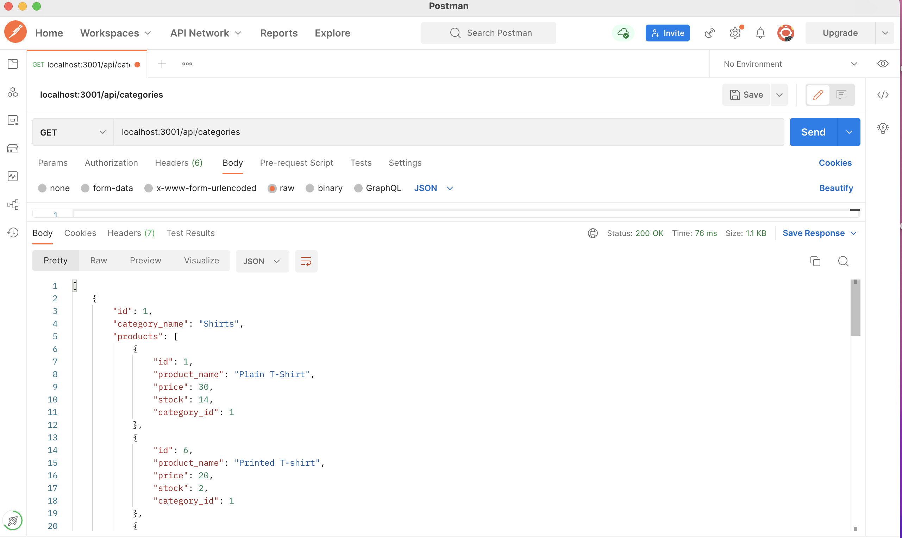
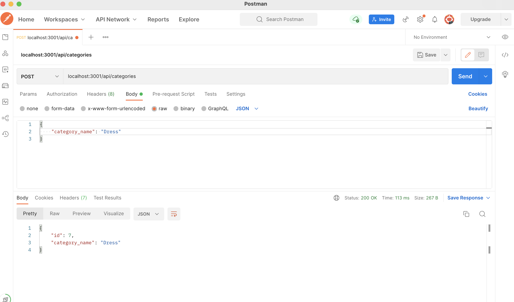

# Ecommerce Backend

## Description
* AS a manager at an internet retail company, WANTS a back end for my e-commernce website that uses the lastest technologies, SO that company can compete with other e-commerce companies.

## Table of contents

-[Description](#description)

-[Acceptance-Criteria](#acceptance-criteria)

-[How to](#how-to)

-[Mock-up screen](#mock-up-screen)

## Acceptance Criteria 

Given a functional Express.js API
User is able to connect to database using Sequelize using username, password for MYSQL
WHEN user runs command line instruction, THEN a database is created and seeded with test data and application is invoked
WHEN user opens API GET routes in Postman for categories, products or tag, THEN data for each of these routes is displayed in a formatted JSON
WHEN user test API POST, PUT, and DELETE routes in Postman, THEN user is able to successfully create, update and delete data from database

## How to:

* This applciation uses node.js, Sequelize

* How to Install: 
npm init
npm i express
npm i sequelize
npm i dotenv
npm run seed - to update seeds to database

* How to Invoke: in command line 'node server.js'

## Mock-up screen:

### Github URL: 
https://github.com/Sivaparam/e-commerce-backend

### Demo of Application:

https://drive.google.com/file/d/1DL4tXzZiHetX-UopQS7x7A1LcFTUcyRc/view

